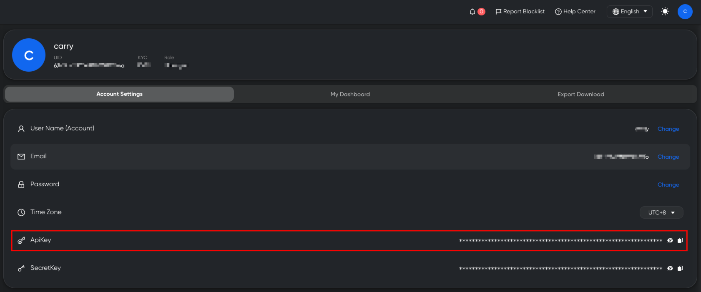

# Domain, Authentication & App ID

### 1. API Base URL

All V3 API endpoints are accessible via:

```
https://openapi.trustformer.info
```

***

### 2. Authentication

#### 2.1 Obtaining API Key

<figure><figcaption></figcaption></figure>

After logging into the KYT system:

1. Navigate to **Account Settings**
2. Generate or view your **API Key**

***

#### 2.2 Passing the API Key

For all API requests, include the `apikey` parameter in the request URL.

Example:

```
GET https://openapi.trustformer.info/v3/xxx?apikey=YOUR_API_KEY
```

***

#### 2.3 Version Upgrade Notice (V2 → V3)

* V3 no longer requires the `secretkey` parameter.
* Only `apikey` authentication is required.

***

#### 2.4 Authentication Error Response

If the API Key is invalid or expired, the system returns:

```
{
  "code": -1,
  "data": {},
  "message": "api_key is invalid"
}
```

| Field   | Type   | Description                         |
| ------- | ------ | ----------------------------------- |
| code    | int    | Error code (-1 indicates auth fail) |
| data    | object | Empty object                        |
| message | string | Error message                       |

***

### 3. App ID (APPID)

#### 3.1 What is an App ID?

<figure><figcaption></figcaption></figure>

In the KYT **Rule Engine**, users can create an **App**.

An App represents a customized risk configuration, including:

* Risk type thresholds
* Risk Level adjustment rules
* Alert triggering logic

After creating an App, the system will display the corresponding **App ID** at the top of the page.

***

#### 3.2 How App ID Works

When calling OPENAPI endpoints:

* If `appid` is NOT provided\
  → The system uses the default Risk Engine configuration.
* If `appid` is provided\
  → The Risk Engine dynamically adjusts risk evaluation results\
  → Based on the user-defined Risk Threshold configuration.

This allows clients to implement personalized risk control strategies.
